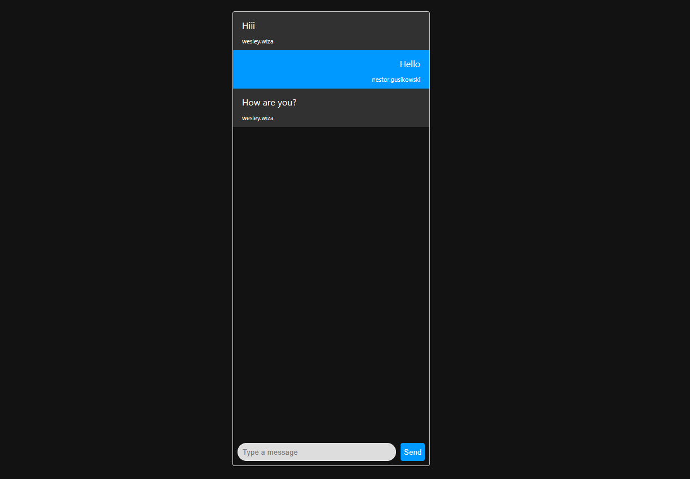

## Real-Time Chat with node.js and socket.io

This project is a basic exercise to learn how sockets work through the socket.io and express libraries.
The application demonstrates how a real-time chat between two people works through sockets.




## Requirements

* Node.js v18
* Express
* Socket.io

## Common configuration

Clone the repository and install the dependencies.

```tap
git clone https://github.com/laura-vargas-dev/real-time-chat.git
cd real-time-chat
```

```tap
npm install
```

## Steps for read-only access

To start the express server, run the following

```tap
npm run dev
```

Open [http://localhost:3000](http://localhost:3000) and take a look.